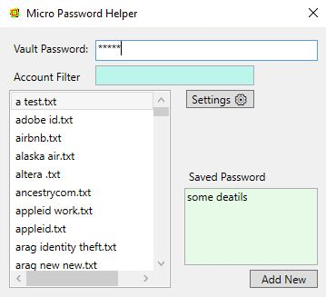

# MicroPass
A simple password management tool

# Setup
Download the [release](https://github.com/GuMiner/MicroPass/releases/tag/v2.0), uncompress, and run. No installation required!

# Usage
1. Run the app
2. Click on 'Settings' to change the path to store encrypted passwords to

# Encryption
Passwords are encrypted with AES-256 encoding using the Vault Password.

When added, each password is encryted with the Vault Password.
> You can use different Vault Passwords for different stored passwords, but this tool won't tell you what Vault Password decrypts each password.